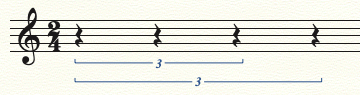

```{r, include = FALSE, message = FALSE}
knitr::opts_chunk$set(
  collapse = TRUE,
  comment = "#>",
  eval = identical(Sys.getenv("gm_vignette"), "true")
)
```


The package name "gm" means "grammar of music" or "generate music".

It provides a simple and intuitive high-level language, with which you can
create music easily. It generates and embeds musical scores and audio files
in R Markdown documents, R Jupyter Notebooks and RStudio seamlessly.

Let's go through a quick example to get a feeling of it.


## Quick Example

Load gm:

```{r message = FALSE}
library(gm)
```

Initialize an empty `Music` object:

```{r}
m <- Music()
```

Add components:

```{r}
m <- m +
  # add a 4/4 time signature
  Meter(4, 4) +
  # add a musical line of a C5 whole note
  Line(pitches = list("C5"), durations = list("whole"))
```

Print the `Music` object to see a brief description of it:

```{r}
m
```

Convert the `Music` object to musical score and audio file:

```{r}
show(m, to = c("score", "audio"))
```

Continue.

Add a tempo mark:

```{r}
m <- m + Tempo(120)
show(m)
```

Add another musical line as a part:

```{r}
m <- m + Line(
  pitches = list("C3", "G3"),
  durations = list("half", "half")
)

show(m)
```

Add another musical line as a voice:

```{r}
m <- m + Line(
  pitches = list(c("E4", "G4"), c("D4", "F4"), c("F4", "A4"), c("E4", "G4")),
  durations = list("quarter", "quarter", "quarter", "quarter"),
  as = "voice",
  to = 1
)

show(m)
```

This process can keep going, but let's stop here. If you want to go deeper,
let's first learn how to install and configure gm.


## Installation

Install gm from CRAN:

```r
install.packages("gm")
```

Or install the development version from GitHub:

```r
# install devtools if not
# install.packages("devtools")

devtools::install_github("flujoo/gm")
```

Download and install [MuseScore](https://musescore.org/),
an open source and free notation software, which gm uses internally.


## Configuration

If you don't install MuseScore to the
[default path](https://musescore.org/en/handbook/3/revert-factory-settings),
please specify the path to the MuseScore executable.

First, open .Renviron file. You can do this with

```r
usethis::edit_r_environ()
```

Next, add an environment variable into it:

```
MUSESCORE_PATH=<path to MuseScore executable>
```

Last, restart R session to activate the change.

For example, suppose the path on a Windows system is

```
C:/Program Files/MuseScore 3/bin/MuseScore3.exe
```

If gm can't find it, you can add

```
MUSESCORE_PATH=C:/Program Files/MuseScore 3/bin/MuseScore3.exe
```

Now below is a complete guide to gm.


## `Music` Objects

gm uses `Music` objects to represent music.

The workflow is usually like this:

1. Initialize an empty `Music` object with `Music()`.

2. Add components to it with `+`, for example, `Music() + Meter(4, 4)`.

3. Print it, or convert it to musical score or audio file with `show()`
to check its structure.

4. Keep adding components and checking it until you get what you want.

5. Sometimes you may want to export the final `Music` object with `export()`.

The workflow and the grammar may remind you of ggplot2.

Let's have a look at each component that you can add to a `Music` object.


## `Line` Objects

We use `Line` objects to represent musical lines.

Create a `Line` object with `Line()`:

```{r}
l <- Line(
  pitches = list("C4", c("E4", "G4"), NA),
  durations = list("quarter", "quarter", "quarter")
)
```

This `Line` object consists of a note, a chord and a rest.

Print it to check its structure:

```{r}
l
```

Add it to a `Music` object to convert it to musical score:

```{r}
m <- Music() + Meter(4, 4) + l
show(m)
```

As you may have noticed, to represent a musical line, we don't directly supply
notes, chords, or rests to `Line()` as input. Instead, we separate the line's
pitch and durational contents. This is more convenient, since you may always 
want to deal with one aspect and in the meantime ignore the other.


### Pitches

The `pitches` argument in `Line()` represents a musical line's pitch contents.

`pitches` must be a list, whose members can be

1. single pitch notations, like `"C4"`, to represent the pitch contents of
notes,

2. single MIDI note numbers, like `60` or `"60"`, also to represent the pitch
contents of notes,

3. single `NA`s to represent the pitch contents of rests, and

4. vectors of pitch notations and MIDI note numbers, like `c("C4", "61")`,
to represent the pitch contents of chords.

A pitch notation consists of

1. a tone name (from A to G),
2. an optional accidental (\-, \-\-, \# or \#\#), and
3. a number identifying the pitch's octave (from 0 to 9).

A MIDI note number is a number between 12 and 127.

See a
[conversion table](https://en.wikipedia.org/wiki/Scientific_pitch_notation#Table_of_note_frequencies)
of pitch notations and MIDI note numbers.

An advantage of MIDI note numbers is that they are easy to operate. For
example, we have the following four MIDI note numbers:

```{r}
pitches <- c(60, 62, 64, 65)
```

```{r, echo = FALSE}
m <- Music() + Meter(4, 4) + Line(as.list(pitches), rep(list(1), 4))
show(m)
```

We can transpose them up by a fifth easily:

```{r}
pitches + 7
```

```{r, echo = FALSE}
m <- Music() + Meter(4, 4) + Line(as.list(pitches + 7), rep(list(1), 4))
show(m)
```

However, this advantage comes at a cost: MIDI note numbers are always
ambiguous. For example, the following three pitches are all equivalent to
MIDI note number 73:

```{r, echo = FALSE}
m <- Music() + Meter(3, 4) + Line(list("C#5", "D-5", "B##4"), list(1, 1, 1))
show(m)
```

gm interprets MIDI note numbers based on keys and neighbor pitches. In the
following example, MIDI note number 73 is interpreted as C5 sharp in the
first measure, but as D5 flat in the second measure, for these two measures
have different keys.

```{r}
l <- Line(list(73, 73), list(2, 2))
m <- Music() + Meter(2, 4) + Key(7, bar = 1) + Key(-7, bar = 2) + l
show(m)
```

gm is not perfect in interpreting MIDI note numbers, so if you want it to
be precise, use pitch notations.


### Durations

The `durations` argument in `Line()` represents a musical line’s durational
contents.

`durations` must be a list, whose members can be

1. single duration notations or their abbreviations, like `"quarter"` or
just `"q"`,

2. single duration values, like `1`, which is equivalent to `"quarter"`, and

3. `Duration` objects returned by `tuplet()`, which is used to create complex
tuplets.

The most basic duration notations consist of only duration types. The
duration types (and their abbreviations) defined in gm are:

```{r, echo = FALSE}
for (i in 1:length(gm:::duration_types)) {
  cat(paste0(
    '"', (gm:::duration_types)[i], '" (',
    '"', (gm:::duration_type_abbrs)[i], '")\n'
  ))
}
```

For example, the following musical line consists of a whole rest, a quarter
rest, and a 32nd rest:

```{r}
m <- Music() + Meter(6, 4) + Line(list(NA, NA, NA), list("w", "q", "32"))
show(m)
```

The duration type or its abbreviation can be followed by zero to four dots,
in a duration notation, as in the following example:

```{r}
l <- Line(rep(list(NA), 5), list("q", "q.", "q..", "q...", "q...."))
m <- Music() + Meter(9, 4) + l
show(m)
```

You can also append what we call "tupler" notations in gm to a duration
notation to represent a tuplet:

```{r}
l <- Line(rep(list(NA), 3), list("q/3", "q/3", "q/3"))
m <- Music() + Meter(1, 4) + l
show(m)
```

In the above example, we use `"q/3"` to represent a triplet. You can read
`"q/3"` as "divide a quarter note into three parts, and take one of them".
We will talk more about tuplets in the next section.

To sum up, a duration notation consists of

1. a duration type or its abbreviation,
2. zero to four dots, and
3. zero or more tupler notations.

You get a duration value when convert a duration notation to value. For
example, `1` is equivalent to `"quarter"`, and `1.5` to `"quarter."`.

However, the duration notations that can be converted to duration values must
NOT contain tupler notation. For example, if you convert `"q/3"` to *value*,
you get `1/3`, but this in gm is not a valid *duration value*. We put this
restriction to avoid ambiguity. For example, value `1/3` can be `"q/3"`,
`"half/6"`, or two tied `"eighth/3"`s.

Also note that you can NOT use characters to represent duration values. For
example, you can use duration value `1` to represent quarter note, but not 
`"1"`, which is invalid in gm. This is also to avoid ambiguity. For example,
we can use `"eighth"` to represent eighth note, whose abbreviation is `"8"`.
if `"8"` was a duration value, it would represent breve note, there would
be a conflict. So keep `"8"` to only eighth note, and `8` to breve note.


### Tuplets

Duration notations can't represent some complex tuplets.

For example, how to represent the first tuplet in the following score:

```{r, echo = FALSE}
t1 <- tuplet("q", Tupler(3, take = "q"))
t2 <- tuplet("q", Tupler(3, take = "8"))

m <- Music() + Meter(1, 4) + Line(list(NA, NA), list(t1, t2))
show(m)
```

This tuplet can read as "divide a quarter note into three parts, take two
of them". We can't express "take two" in any duration notation. This is where
we need `tuplet()` and `Tupler()`. Let's look at an example.

We can express duration notation `"quarter/3"` with `tuplet()` and `Tupler()`
as:

```{r}
t <- tuplet("quarter", Tupler(3, unit = "eighth", take = "eighth"))
```

This code can read as: divide a quarter note (`tuplet("quarter", ...)`) into
there parts (`Tupler(3, ...)`), each part is an eighth note
(`unit = "eighth"`), and we take one part (`take = "eighth"`).

Print it and we can see it is just equivalent to `"quarter/3"`:

```{r}
t
```

Modify the code and we can represent the aforementioned tuplet:

```{r}
tuplet("quarter", Tupler(3, unit = "eighth", take = "quarter"))
```

The difference is that this time we take two parts or units.

To sum up, we use `tuplet()` to create complex tuplets, and `Tupler()` to
specify how to divide a duration into parts and what to take from these parts.

We can go further with these two functions.

For example, we can change `unit` in the above example:

```{r}
t <- tuplet("quarter", Tupler(3, unit = "quarter", take = "quarter"))
t
```

The score looks like this:

```{r}
m <- Music() + Meter(1, 4) + Line(list(NA, NA, NA), list(t, t, t))
show(m)
```

This may seem strange to you, but it's syntactically valid.

We can even create complex nested tuplets like in the following score:


The first three tuplets can be represented by:

```{r}
t <- tuplet(
  "half",
  Tupler(3, unit = "quarter", take = "half"),
  Tupler(3, unit = "quarter", take = "quarter")
)

t
```

Note that there are two `Tupler` objects in the above code.

Create this score:

```{r}
l <- Line(rep(list(NA), 4), list(t, t, t, tuplet("half/3")))
m <- Music() + Meter(2, 4) + l
show(m)
```

Yes, there is something wrong with this score. MuseScore (which gm uses
internally) has some bugs, so it can't convert MusicXML (which gm uses to
represent musical scores internally) containing nested tuplets to score 
correctly. So if there are nested tuplets in your `Music` object, you can
export it to MusicXML file with `export()`, and open the file with other
notation software like Finale. Below is a correct score generated in Finale:



Note that in `Line()` objects, tuplets must form tuplet groups, or you will
get an error. For example,

```{r, error = TRUE}
# try to create a `Line` object which consists of only one tuplet
Line(list(NA), list("q/3"))
```

Also note that tuplet groups must NOT cross barline. For example,

```{r, error = TRUE}
l <- Line(list(NA, NA, NA), list("h/3", "h/3", "h/3"))
m <- Music() + Meter(1, 4) + l
show(m)
```


### Tie

Sometimes you may want to tie together some notes, you can do this by
specifying the argument `tie` in `Line()`.

```{r}
l <- Line(
  pitches = list(c("C5", "E5"), c("C5", "E5"), c("C5", "E5"), c("C5", "E5")),
  durations = list("quarter", "quarter", "quarter", "quarter"),
  tie = list(c(1, 1), c(2, 2), 3)
)

m <- Music() + Meter(4, 4) + l
show(m)
```

In `tie = list(c(1, 1), c(2, 2), 3)` in the above example,

1. `c(1, 1)` means we add a tie to the first note of the first chord to
connect it with the first note of the second chord. Note that to tie two
adjacent notes, we only specify the position of the first note.

2. Similarly, `c(2, 2)` means we add a tie to the second note of the second
chord to connect it with the second note of the third chord.

3. `3` means we add ties to the whole third chord to connect it with the
fourth chord.

However, don't bother to split a cross-bar note and tie resulted notes
together, gm takes care of this kind of situations, like in the following
example:

```{r}
m <- Music() + Meter(1, 4) + Line(list("C5"), list(4))
show(m)
```

The C5 whole note is automatically split into four tied quarter notes,
because the time signature is 1/4.


### `bar` and `offset`

With these two arguments in `Line()`, you can easily insert a `Line` object
at other positions rather than the first beat of the first measure.

For example, below is an ordinary `Line` object:

```{r}
l <- Line(list("C5", "D5", "E5"), list(1, 1, 1))
m <- Music() + Meter(4, 4) + l
show(m)
```

We can insert it into the third measure after the second beat:

```{r}
l <- Line(list("C5", "D5", "E5"), list(1, 1, 1), bar = 3, offset = 2)
m <- Music() + Meter(4, 4) + l
show(m)
```


### Multiple `Line` Objects

We can add multiple `Line` objects to a `Music` object in different ways.

For example, below is a `Music` object that consists of only one `Line`
object:

```{r}
l1 <- Line(rep(list("E5"), 8), rep(list(0.5), 8), name = "a")
m <- Music() + Meter(4, 4) + l1
show(m)
```

The `Line` object is named "a" with argument `name`.

Below is another `Line` object named "b":

```r
Line(list("C4", "G4"), list(2, 2), name = "b")
```

We can add `Line` "b" as another **part**:

```{r}
l2 <- Line(list("C4", "G4"), list(2, 2), name = "b")
show(m + l2)
```

`Line` "b" is appended at the end by default. We can make `Line` "b" come
before `Line` "a", by specifying argument `to` and `after`:

```{r}
l2 <- Line(list("C4", "G4"), list(2, 2), name = "b", to = "a", after = FALSE)
m <- m + l2
show(m)
```

`to = "a"` means we add `Line` "b" with `Line` "a" as a reference.

The `Music` object contains two `Line` objects now. Let's introduce a third
`Line` object named "c":

```r
Line(list("A4", "B4", "C5"), rep(list("w/3"), 3), name = "c")
```

We can add it to `Line` "a" as another **voice**:

```{r}
l3 <- Line(
  pitches = list("A4", "B4", "C5"),
  durations = rep(list("w/3"), 3),
  name = "c",
  to = "a",
  as = "voice"
)

m <- m + l3
show(m)
```

Finally, below is a fourth `Line`, let's add it to `Line` "b" as another
**staff**:

```{r}
l4 <- Line(list("E3"), list(4), to = "b", as = "staff", name = "d")
m <- m + l4
show(m)
```

We can print this `Music` to check its structure:

```{r}
m
```

The `Music` contains four `Line`s now, which have different states. In summary,
there are two parts, the first part contains two staffs, which are `Line` "b"
and `Line` "d", and the second part contains one staff which has two voices,
which are `Line` "a" and `Line` "c".

With these arguments in `Line()` we have so far introduced, you can create
quite complex musical scores easily.


## `Meter` Objects

We use `Meter` objects to represent time signatures.

For example, 3/4 time signature can be represented by

```{r}
Meter(number = 3, unit = 4)
```

We can add it to a `Music` object:

```{r}
Music() + Meter(3, 4)
```

To change time signature in the middle, we can add another `Meter` object with
specific `bar`. For example,

```{r}
m <- Music() + Meter(3, 4) + Meter(1, 8, bar = 2)
m
```

Add a `Line`, we can convert this `Music` to score:

```{r}
m <- m + Line(list("G4", "A4"), list(3, 0.5))
show(m)
```

By specifying arguments `actual_number` and `actual_unit`, we can create
**pickup measures**. For example,

```{r}
m <- Music() +
  Meter(4, 4, actual_number = 1, actual_unit = 4) +
  Meter(4, 4, bar = 2, invisible = TRUE)

m

l <- Line(list("A4", "B4", "C5", "D5", "E5"), rep(list(1), 5))
show(m + l)
```

The time signature which appears on the first measure is 4/4, but the actual
one is 1/4. `invisible = TRUE` makes the second time signature invisible.


## `Key` Objects

We use `Key` objects to represent key signatures.

By specifying argument `key` in `Key()`, we can create key signatures from
C flat major to C sharp major.

```{r}
for (key in -7:7) {
  print(Key(key))
}
```

By specifying argument `bar` in `Key()`, we can change the key signature of
a musical score in the middle. For example,

```{r}
m <- Music() + Meter(1, 4) + Key(-7) + Key(0, bar = 2) + Key(7, bar = 3)
m

l <- Line(list(NA, NA, NA), list(1, 1, 1))
show(m + l)
```

We can add a key signature to a specific part or staff, rather than to the
whole score. For example, below is a musical score of two parts:

```{r}
m <- Music() + Meter(4, 4) +
  Line(list("E5"), list(4)) +
  Line(list("G4", "A4"), list(2, 2), to = 1, as = "staff") +
  Line(list("C4"), list(4)) +
  Line(list("C3", "D3"), list(2, 2), to = 3, as = "staff")

show(m)
```

We can change the key signature of only the first part:

```{r}
m <- m + Key(-2, to = 1)
show(m)
```

`to = 1` means the `Key` object is added only to the part containing the first
`Line` in the `Music` object.

We can change the key signature of only the second staff of the second part:

```{r}
m <- m + Key(2, to = 4, scope = "staff")
show(m)
```

`scope = "staff"` means the key signature is added only to a specific staff.


## `Clef` Objects

We use `Clef` objects to represent clefs.

`Clef` objects you can create in gm are:

```{r}
Clef("G")

Clef("G", line = 1)

Clef("G", octave = 1)

Clef("G", octave = -1)

Clef("F")

Clef("F", line = 3)

Clef("F", line = 5)

Clef("F", octave = 1)

Clef("F", octave = -1)

Clef("C")

Clef("C", line = 1)

Clef("C", line = 2)

Clef("C", line = 4)

Clef("C", line = 5)
```

gm automatically adds a clef to a staff based on its pitch contents, if
the staff has no clef at the beginning. For example, in the following score,
gm adds an alto clef to the staff:

```{r}
l <- Line(list("B3", "C4", "D4"), list(3, 3, 3))
m <- Music() + Meter(3, 4) + l
show(m)
```

If not satisfied, you can change it:

```{r}
m <- m + Clef("G", to = 1)
show(m)
```

You can also add a clef into other measures:

```{r}
m <- m + Clef("F", to = 1, bar = 2)
show(m)
```

Or even at other beat:

```{r}
m <- m + Clef("G", octave = -1, to = 1, bar = 3, offset = 2)
show(m)
```


## `Tempo` Objects

We use `Tempo` objects to represent tempo marks.

We can create a `Tempo` object with `Tempo()`. For example,

```{r}
Tempo(tempo = 240)
```

`tempo = 240` means the speed is 240 quarter notes per minute. The default
unit is quarter note, you can change it with argument `unit`:

```{r}
Tempo(tempo = 240, unit = "half")
```

These two speeds, 240 quarter notes per minute and 120 half notes per minute,
are nonetheless equivalent.

With arguments `bar` and `offset`, you can add a `Tempo` object at any
position. For example,

```{r}
m <- Music() +
  Meter(4, 4) +
  Line(as.list(70:77), rep(list(1), 8)) +
  Tempo(60) +
  Tempo(240, unit = "half.", bar = 1, offset = 2.5)

show(m, to = c("score", "audio"))
```


## Comparison

At the time of writing, the author knows only 
[tabr](https://github.com/leonawicz/tabr)
that has similar purposes and similar level of functionality to gm,
among other R packages.

However, there are some noticeable differences:

- Besides music generation, tabr also provides functions for music analysis
and manipulation.
- tabr can generate guitar tabs and add more music notation symbols to
score than gm can. gm is not yet for professional level music notation.
- gm embeds generated music in R Markdown documents and R Jupyter Notebooks,
while tabr exports it.
- gm uses R's basic data structures such as vector and list
to represent music, while tabr uses strings.
- gm's language is simpler than tabr's, it is more straightforward
to add components such as musical lines in gm. This and the above difference
make gm more suitable for music programming.

In Python, [music21](http://web.mit.edu/music21/)
is a mature library which provides abundant
tools for music generation and analysis. For its music generation 
functionality, music21 can generate more professional musical scores than
gm can, and also works in Python Jupyter Notebooks. However, at its core,
gm's language is far simpler and more intuitive. For example, in music21, 

- it's cumbersome to define notes and add them to musical
lines,
- users have to be concerned about musical score structures when they only
want to express music structures at a higher level,
- creation of complex and nested tuplets is not straightforward,
- ...

In summary, gm is a good tool for expression of high-level music structures
and communication of generated music. It's not yet for professional level
music notation.


## Algorithmic Composition

gm's language is simple but powerful. One possible use of gm is
algorithmic composition, which means using algorithms to create music.

Below is an example:

```{r}
pitches <- as.list(c(64, 65, 69, 71, 72, 76))
durations <- rep(list(1), length(pitches))

m <- Music() + Meter(4, 4) + Tempo(120)

for (i in 0:8) {
  m <- m + Line(pitches, durations, offset = 0.5 * i)
}

show(m, to = c("score", "audio"))
```

The code generates nine parts which all contain the same pitch and durational
contents. The only difference is that their delays are gradually increased,
to create the interesting echo sound effect.

In this example, you can see how gm uses R's basic data structures to
represent pitches and durations, and how gm's language is simple and 
high-level. These two features make gm very suitable for music programming,
without users considering music notation details.


## Citation, Donation and Contact

Cite gm:

```r
citation(package = "gm")
```

if you appreciate gm, please consider a donation:

<https://ko-fi.com/flujoo>

Please free to contact me if you want to say anything:

renfeimao AT gmail.com
